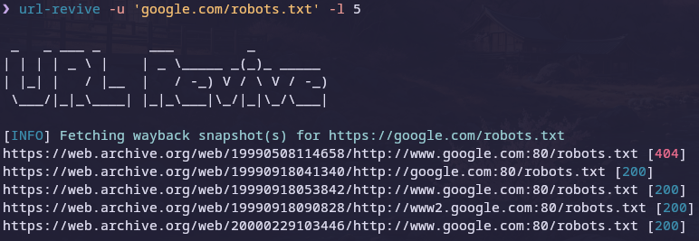

# url-revive

[](https://opensource.org/licenses/MIT)

Bring those dead links back to life.



This tool prioritizes simplicity and is designed to fetch records for links from various internet archives. 
Security researchers can use it to find secrets like exposed API keys or hidden endpoints.

It provides fine grained controls for matching status codes and limiting results, thus ensuring fast queries. 
Default mode is the most flexible and uses Wayback Machine, while Memento mode is slower but capable of searching additional archives.
Another mode is planned for a future release, so stay tuned!

## Installation
Install with ease using pip.
```
pip install url-revive
```
Clone the repo directly.
```
git clone https://github.com/Raymond-JV/url-revive.git
cd url-revive
pip install .
```
## Usage
```nroff
usage: url-revive [-h] [-u URL] [-f [FILE]] [-d] [-nc] [-m] [-r] [-s] [--unique] [-l LIMIT] [-mc MATCH_CODES]

options:
  -h, --help            show this help message and exit

INPUT:
  -u, --url URL         Fetch snapshots for single URL
  -f, --file [FILE]     Read multiple URLs from file

GENERAL:
  -d, --dump            Print source code dump from snapshots
  -nc, --no-color       Do not color output
  -m, --memento         Fetch snapshots from multiple archives with the Memento API
  -r, --raw             Exclude wayback metadata from snapshots
  -s, --silent          Only show snapshots or source code dumps
  --unique              Exclude duplicate URLs

FILTER:
  -l, --limit LIMIT     Limit number of snapshots fetched per URL
  -mc, --match-codes MATCH_CODES
                        Status codes to match -> -mc 200,302,404
```

### Input
```
url-revive -u domain.com
```
```
url-revive -f domains.txt
```
```
cat domains.txt | url-revive
```

## Examples

### Basic Command
```
url-revive -u domain.com
```
By default, only one record is fetched if a limit is not specified. 
Use the ```-mc``` flag for matching specific status codes, and the ```--raw``` flag to fetch original records without metadata.


### Dump Snapshots
```
url-revive -u domain.com --dump 
```
Enable the ```--dump``` flag to print source code from fetched snapshots. Wayback Machine 
enforces strict rate limiting and might drop the connection. While ```url-revive``` strives to respect these
limits, it will always be faster and more reliable to only fetch snapshot URLs.


### Search Endpoints
```
url-revive -u 'www.domain.com/*' --unique 
```
Enable the ```--unique``` flag with an asterisk regex to find endpoints for a domain. This approach is useful when performing 
passive recon on an API because it avoids generating noise.


### Memento Mode
```
url-revive -u domain.com --memento 
```
Enable the ```--memento``` flag to query additional archives. There is a small chance that some
of the the Memento archives will include endpoints not stored by Wayback Machine, but searching them is very slow.
The Memento API specification is interpreted differently by each archive, and every query will return all records
found. Many archives use AJAX to display records, so the ```--dump``` flag will not work in this mode.  


 

